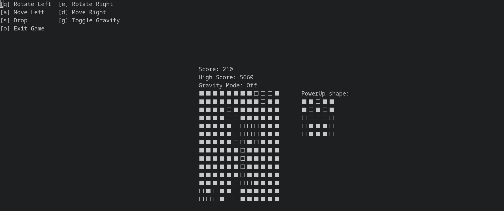
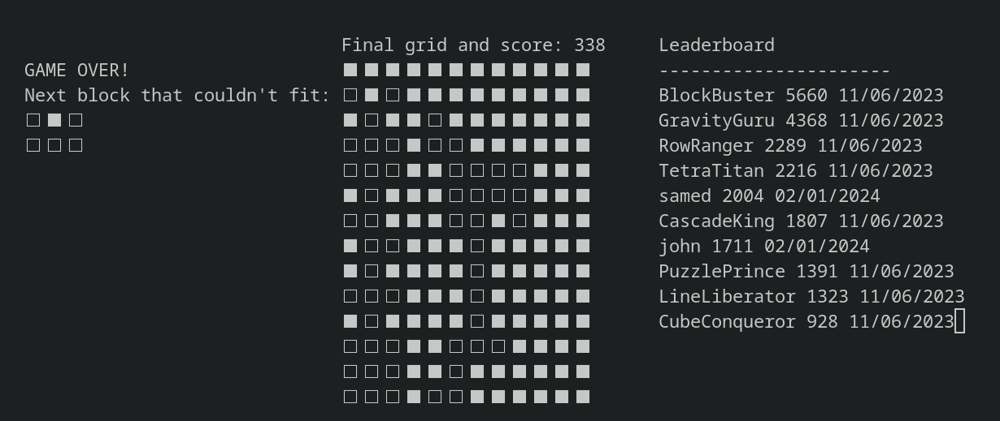
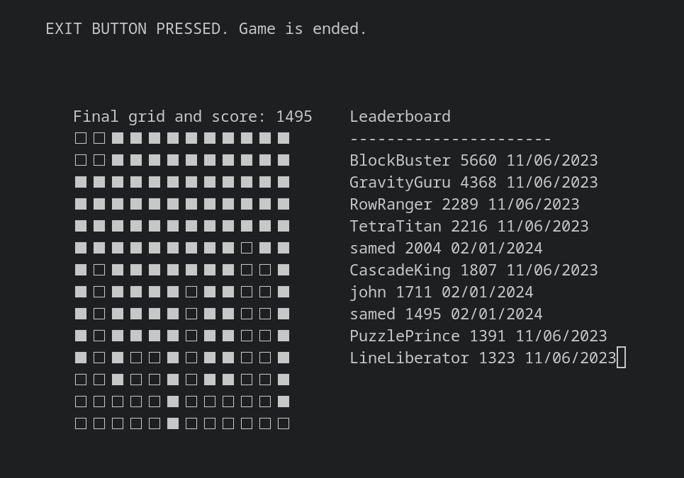

# BlockFall

BlockFall, an implementation of the classic Tetris game with new features in C++11.

## Gameplay

### Controls
* [q]: Rotate left
* [e]: Rotate right
* [a]: Move left
* [d]: Move right
* [s]: Drops block
* [g]: Toggle gravity
* [o]: Exit game

## New Features 

#### Gravity 
" When gravity takes effect, it causes all blocks to fall to the ground."

#### Power Up
* When the power-up shape is constructed on the board, it clears everything and rewards the player with an additional 1000 points. 

## Installation

* Ensure you have the necessary dependencies, including g++ and ncurses, before proceeding with the installation.

1. ` sudo apt-get install g++ libncurses5-dev libncursesw5-dev`
2. `g++ -std=c++11 *.cpp *.h -o blockFall -lncursesw`
3. `./blockFall`

## In-game Photos
#### Gameplay:

#### Gameover Screen:

#### Exit Screen:

